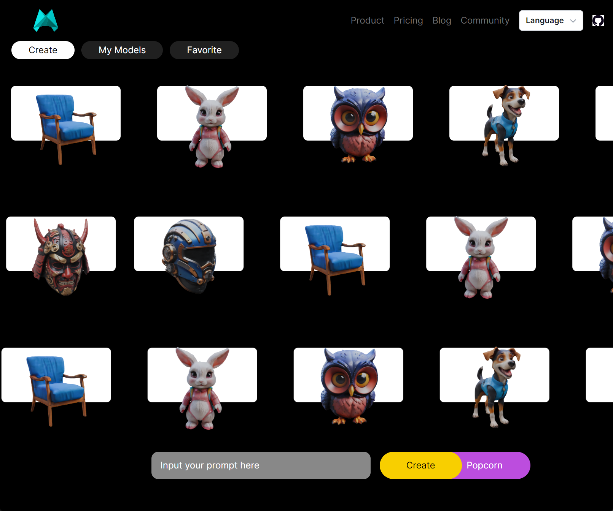
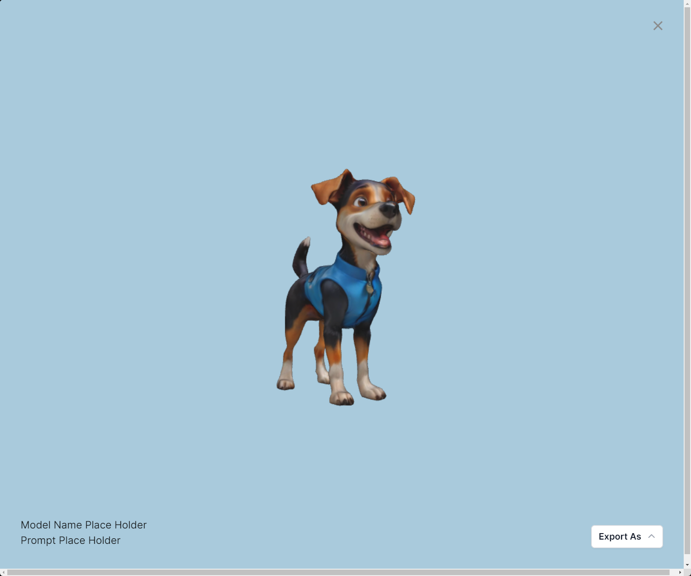
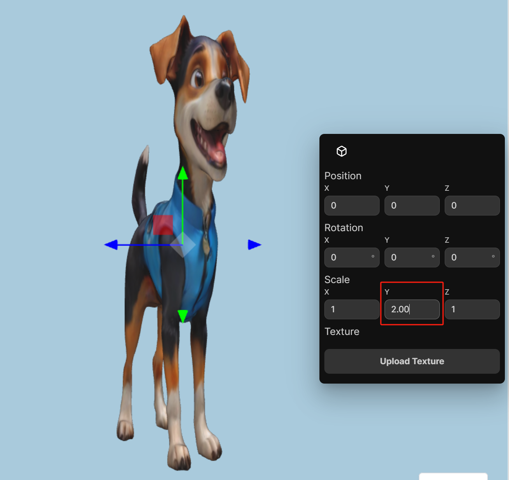
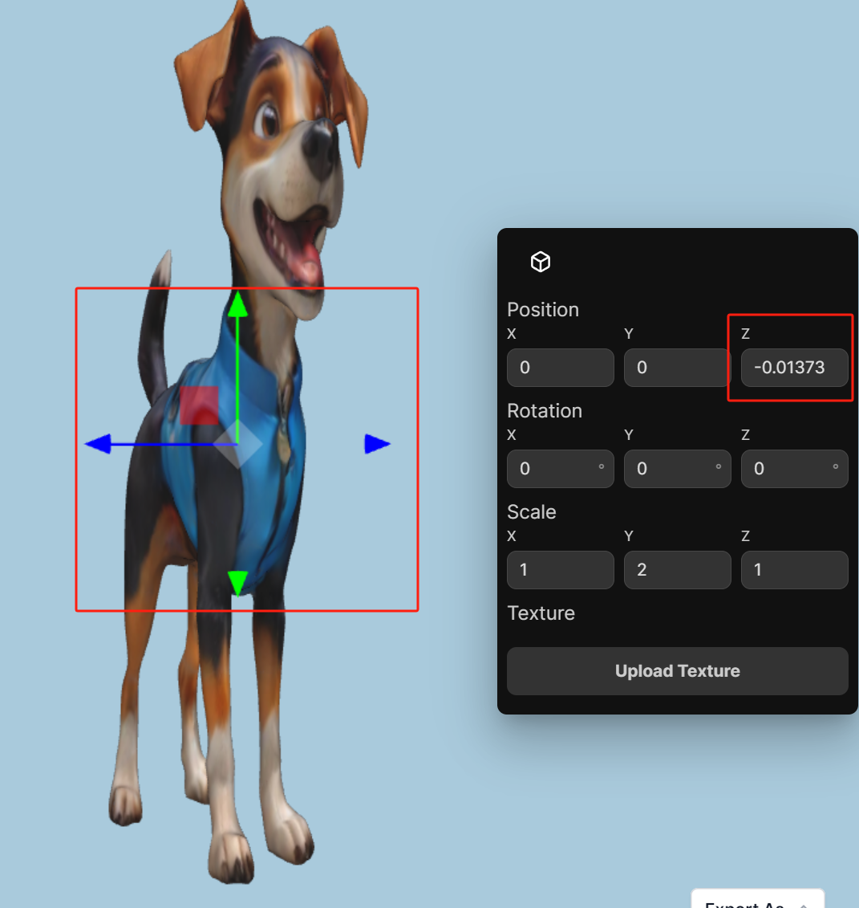
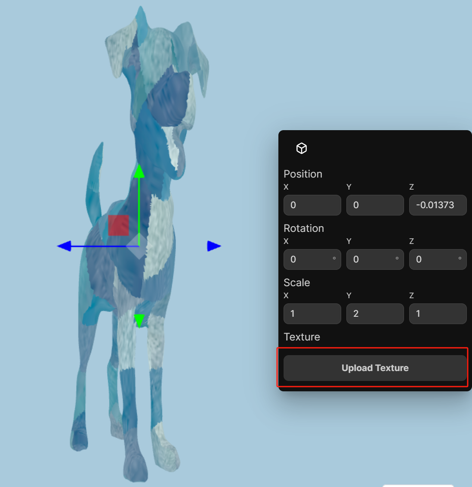
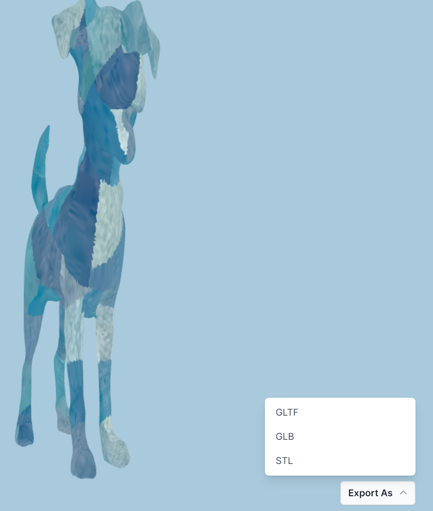
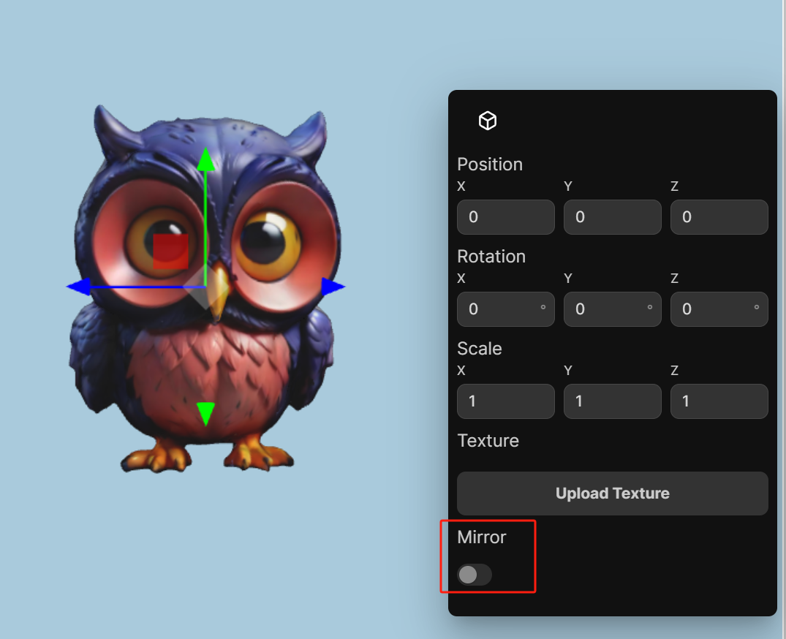
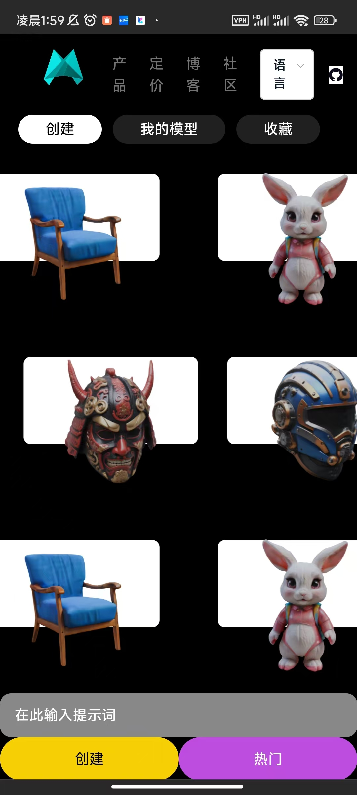
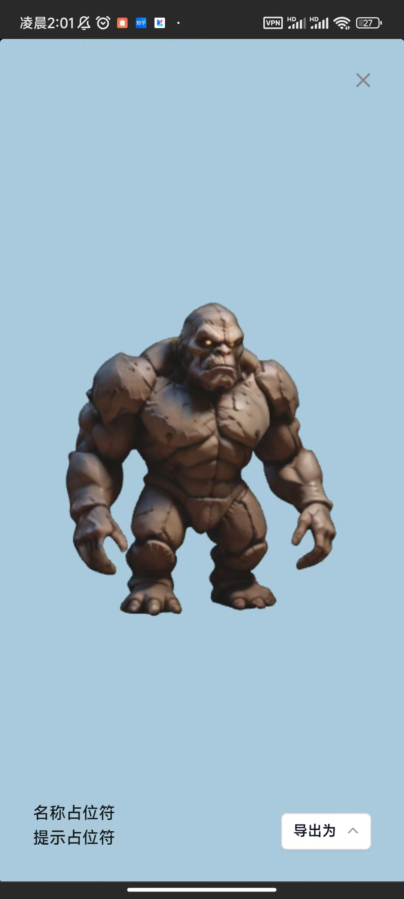

# 3DViewer

# How to run?
``` 
yarn 
yarn dev
```

# Tasks
1. Model lists



2. 3D Viewer



3. Manipulation Controls



4. Display Manipulation Process
When drag the axis, the attribute panel will also change.



# Bonus Tasks
1. Model Texturing



2. 3D Model Export 



3. Additional Manipulation Features
Only support mirror



# Multi devices support
I only support some cases because of limited time. The rest of work are simpily duplicated.


